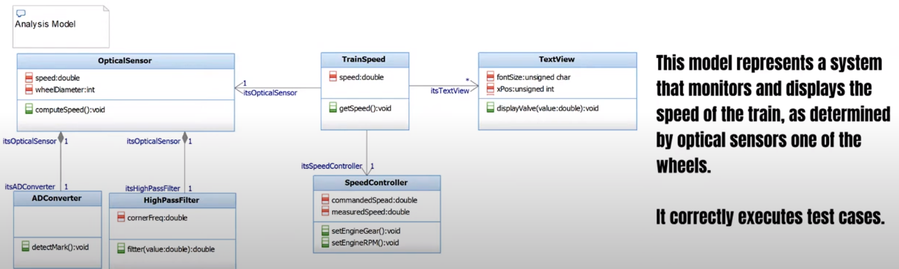
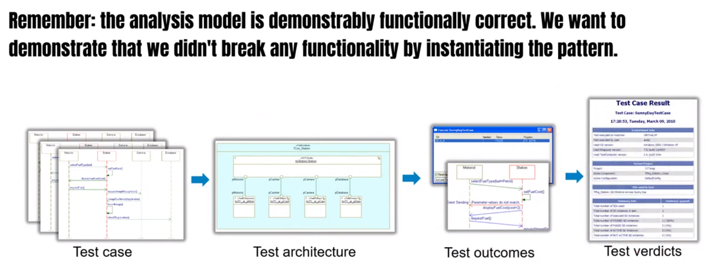

# Design Pattern Notes

## Design Patterns

Design patterns are a generalized solutions to commonly occuring design problems.
Also it is a parametrized collaborations where objects roles are either 
glue elements that link together the pattern, or formal parameters, that are replaced by elements from your analysis model.

Design models provide a way achieve design optimizations using a set of technical approaches that have well-defined pros and cons. 

## Applying Design Patterns

### Aspects of Design Patterns

1. Applicability: referes to the proberites of the analysis model that make the pattern usable or relevant.
2. Soltuin: refers to the structure and behavior of the pattern as a whole and its elements.
3. Benefits: The benefits of the pattern, that is, aspects of the model that are improved or optimized.
4. Cost: the downside of using the pattern, including those aspects of the model that are deoptimized by the pattern.

### Design Pattern Application Workflow

1. Build Analysis

2. Identify Design Critera

3. Select Patterns

4. Examine Tradeoffs

5. Instantiate Patterns

6. Verify Correctness

7. Validate Optimizations

## References

[Bruce-Dogulass](https://www.bruce-douglass.com) 